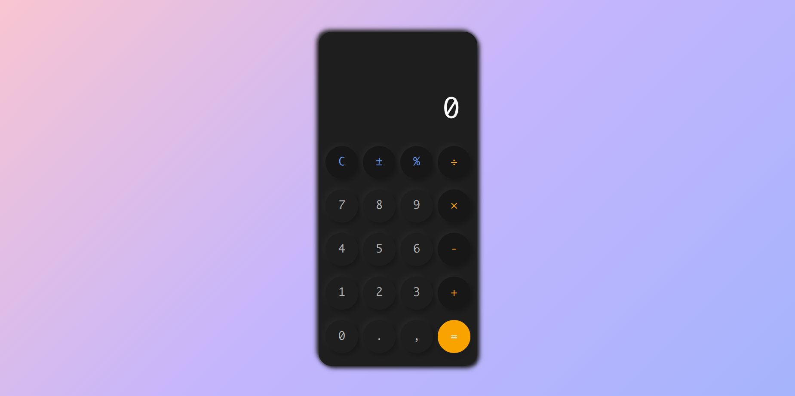

# Calculator

A modern calculator application built with React, TypeScript, and Tailwind CSS featuring a neumorphic design. This project demonstrates a modular approach to creating a calculator UI with reusable components and custom hooks.





# Website URL

➡️ [https://neucalculator.netlify.app/](https://neucalculator.netlify.app/)


## Features

- Clean neumorphic design
- Basic arithmetic operations
- Percentage calculations
- Positive/negative number toggle
- Responsive layout
- Keyboard input support


## Tech Stack

- React + TypeScript
- Tailwind CSS for styling
- Vite as build tool
- Custom hooks for business logic


## Project Structure

```
├── src/
│   ├── components/                    # React components directory
│   │   ├── Button.tsx                # Reusable button component with neumorphic styling
│   │   │                             # Handles click animations and keyboard events
│   │   │
│   │   ├── Calculator.tsx            # Main calculator component that orchestrates the UI
│   │   │                             # Manages layout and component composition
│   │   │
│   │   └── Display.tsx               # Calculator display component
│   │                                 # Handles number formatting and animation
│   │
│   ├── hooks/                        # Custom React hooks directory
│   │   ├── useCalculator.ts          # Core calculator logic
│   │   │                             # Manages state and arithmetic operations
│   │   │
│   │   └── useCalculatorInput.ts     # Input handling hook
│   │                                 # Manages keyboard events and input validation
│   │
│   ├── types/                        # TypeScript type definitions
│   │   └── calculator.types.ts       # Shared interfaces and types
│   │
│   ├── utils/                        # Utility functions
│   │   ├── calculations.ts           # Mathematical operation helpers
│   │   └── formatters.ts             # Number formatting utilities
│   │
│   ├── styles/                       # Style related files
│   │   ├── neumorphic.css           # Custom neumorphic design classes
│   │   └── global.css               # Global styles and Tailwind imports
│   │
│   ├── constants/                    # Application constants
│   │   └── calculator.constants.ts   # Button configurations and math constants
│   │
│   ├── App.tsx                      # Root component, handles theme and layout
│   ├── main.tsx                     # Application entry point
│   └── vite-env.d.ts               # Vite type declarations
│
├── public/                          # Static assets
│   └── images/                      # Image assets
│
├── tests/                          # Test files
│   ├── components/                 # Component tests
│   └── hooks/                      # Hook tests
│
├── index.html                      # HTML entry point
├── package.json                    # Project dependencies and scripts
├── tsconfig.json                   # TypeScript configuration
├── vite.config.ts                 # Vite build configuration
├── tailwind.config.js             # Tailwind CSS configuration
└── README.md                      # Project documentation
```


#### Components
- `Button.tsx`: A reusable button component that implements the neumorphic design system. Handles hover states, active states, and click animations.
- `Calculator.tsx`: The main calculator interface that manages the layout and combines all sub-components. Implements the grid system for button placement.
- `Display.tsx`: Manages the calculator's display, including number formatting, overflow handling, and animation effects.


#### Hooks
- `useCalculator.ts`: Contains the core calculator logic, managing state for:
  - Current input
  - Operation history
  - Memory functions
  - Error handling
- `useCalculatorInput.ts`: Handles all input methods including:
  - Keyboard event binding
  - Input validation
  - Special key combinations


#### Utilities
- `calculations.ts`: Pure functions for mathematical operations
- `formatters.ts`: Number formatting utilities for display
- `calculator.types.ts`: TypeScript interfaces and types used throughout the application


#### Styling
- `neumorphic.css`: Custom CSS classes for the neumorphic design system
- `global.css`: Global styles and Tailwind CSS configuration


#### Configuration
- `vite.config.ts`: Build tool configuration
- `tailwind.config.js`: Tailwind CSS theme and plugin configuration
- `tsconfig.json`: TypeScript compiler options


## Installation

1. Clone the repository:
```bash
git clone git@github.com:imsidharthj/calculator.git
```

2. Install dependencies:
```bash
npm install
```

3. Start the development server:
```bash
npm run dev
```

4. Build for production:
```bash
npm run build
```


## Usage

The calculator supports both mouse/touch input and keyboard controls:

- Numbers: `0-9`
- Operations: `+`, `-`, `*`, `/`
- Equal: `Enter` or `=`
- Clear: `Escape` or `c`
- Decimal: `.`
- Delete: `Backspace`


## Styling

The project uses Tailwind CSS with custom neumorphic design classes:

- `neu-flat`: Base neumorphic elevation
- `neu-pressed`: Pressed state
- `neu-concave`: Concave effect


## Contributing

1. Fork the repository
2. Create your feature branch (`git checkout -b feature/amazing-feature`)
3. Commit your changes (`git commit -m 'Add amazing feature'`)
4. Push to the branch (`git push origin feature/amazing-feature`)
5. Open a Pull Request